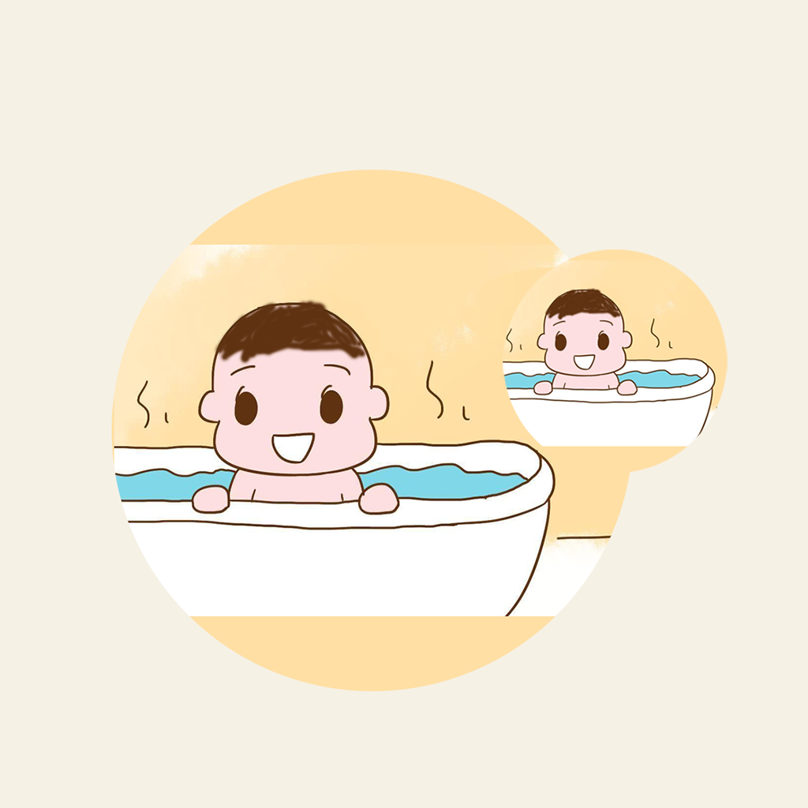

## Welcome to Baby Bath Temperature Record

The parents of each family will bathe the baby, the choice of bath water temperature is very important for the baby. If the water temperature is too hot, it is easy to burn the baby. When the water temperature is too low, the baby is likely to catch a cold. According to the suggestions of doctors and nurses, we can record the temperature of the baby's favorite bathing water, as well as detailed information such as the baby's age and water temperature, to help the baby take a better bath and grow up healthy.

If you have any questions, you can either leave a message or send the questions to our email address.

We will answer them for you in the first time.

### Address: jichungan9498@163.com

Thank you!
